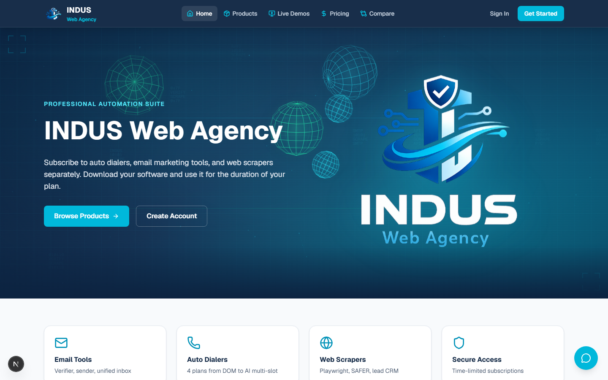
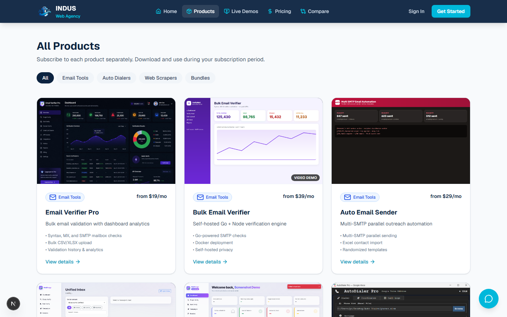
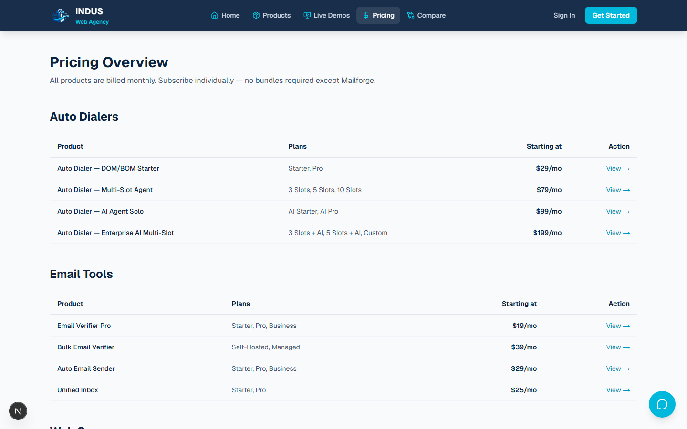
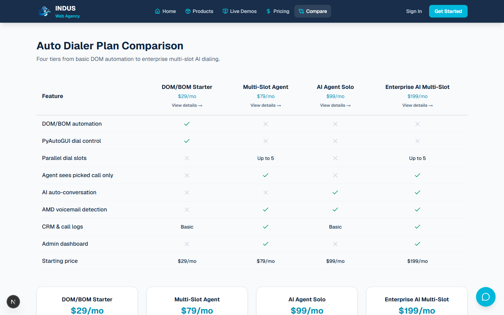
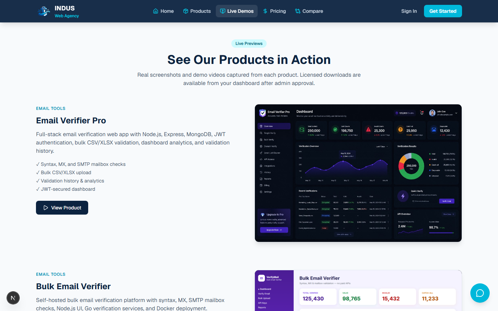
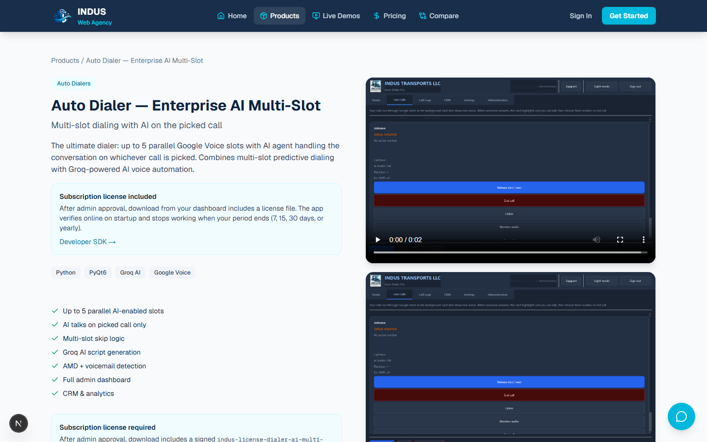

# INDUS Web Agency

Professional automation tools marketplace — subscribe to auto dialers, email marketing tools, and web scrapers individually.

## Live URLs

- **Vercel (full app — auth, subscriptions, downloads):** https://indus-web-agency.vercel.app
- **GitHub Pages (marketing site):** https://mafzalkalwardev.github.io/indus-web-agency/
- **GitHub Repository:** https://github.com/mafzalkalwardev/indus-web-agency

## Screenshots

### Homepage


### Products catalog


### Pricing


### Auto dialer comparison


### Live demos


### Product detail page


## Features

- Customer sign up / login with JWT sessions
- Admin portal for user & subscription management
- 13 products across email, dialer, scraper, and bundle categories
- 4 auto dialer tiers with side-by-side comparison
- Time-limited subscriptions with download access
- Real product screenshots and demo videos
- INDUS Guide — select-only support chat (no typing required)
- Purchase approval email alerts to admin
- Per-product setup guides with downloadable `SETUP.txt` files
- Signed license verification for desktop apps (2-device limit)

## Products

### Email Tools
- Email Verifier Pro
- Bulk Email Verifier
- Auto Email Sender
- Unified Inbox
- Mailforge (bundle)

### Auto Dialers
1. **DOM/BOM Starter** — PyAutoGUI + DOM automation
2. **Multi-Slot Agent** — 5 parallel lines, agent sees picked call only
3. **AI Agent Solo** — AI talks automatically on every call
4. **Enterprise AI Multi-Slot** — Multi-slot + AI on picked call

### Web Scrapers
- Playwright Website Scraper Pro
- FMCSA SAFER Scraper
- Canadian Website Scraper
- Fiverr Lead Extractor CRM

## Quick Start

```bash
npm install
npm run dev
```

Visit http://localhost:3000

### Default Admin Credentials

- Email: `admin@induswebagency.com`
- Password: `Admin@Indus2026!`

Change via environment variables:
```
ADMIN_EMAIL=your@email.com
ADMIN_PASSWORD=your-secure-password
JWT_SECRET=your-jwt-secret
NEXT_PUBLIC_SITE_URL=https://indus-web-agency.vercel.app
```

### Email notifications (purchase alerts)

```
SMTP_HOST=smtp.gmail.com
SMTP_PORT=587
SMTP_USER=induswebagency@gmail.com
SMTP_PASS=your-gmail-app-password
ADMIN_NOTIFICATION_EMAIL=induswebagency@gmail.com
```

### Persistent storage (recommended for production)

By default on Vercel, user data is stored in `/tmp` and resets on cold starts. For persistent storage, add a free [Upstash Redis](https://upstash.com) database and set:

```
UPSTASH_REDIS_REST_URL=your-url
UPSTASH_REDIS_REST_TOKEN=your-token
```

The admin dashboard shows **Storage: redis** when connected.

## Scripts

```bash
npm run capture:media      # Sync product screenshots from local repos
npm run capture:media:live # Capture live product UIs via Playwright
npm run generate:setup     # Regenerate public/setup/*.txt files
node scripts/capture-website-screenshots.mjs  # Refresh README screenshots
```

## Deploy

### Vercel
```bash
npx vercel --prod --yes
```

### GitHub Pages
```bash
npm run build:static
# Output in out/ — served via gh-pages branch
```

## Tech Stack

- Next.js 16 (App Router)
- TypeScript
- Tailwind CSS 4
- JWT auth (jose + bcryptjs)
- Nodemailer (purchase alerts)
- Upstash Redis (optional persistence)
- Playwright (media capture)

## License

MIT
